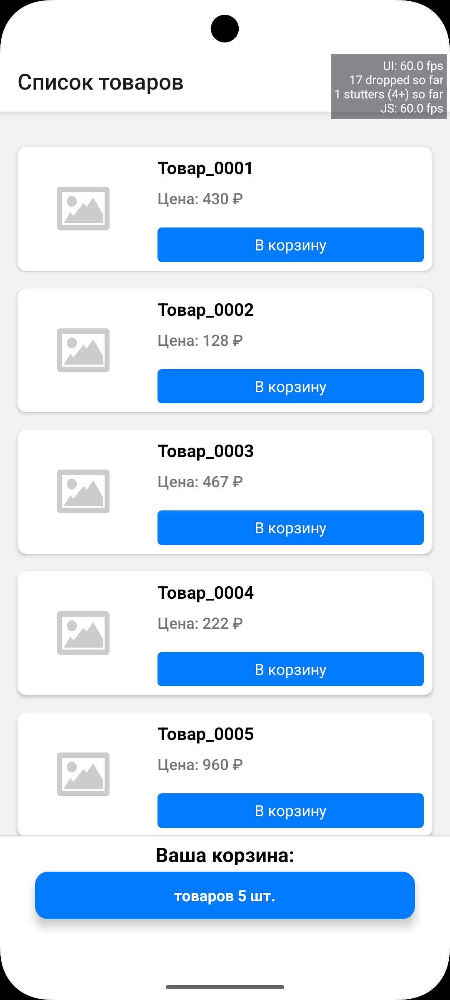
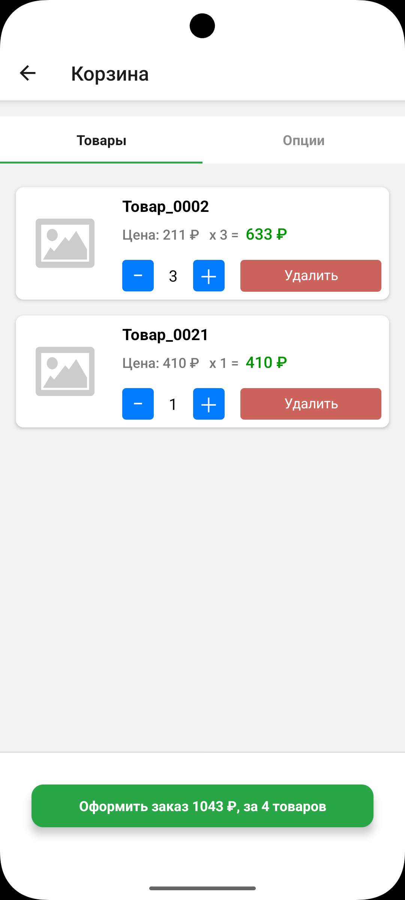
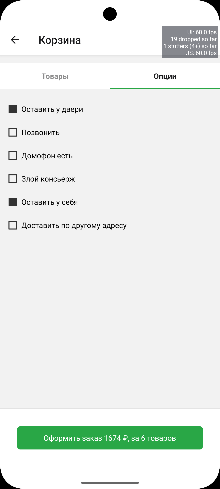
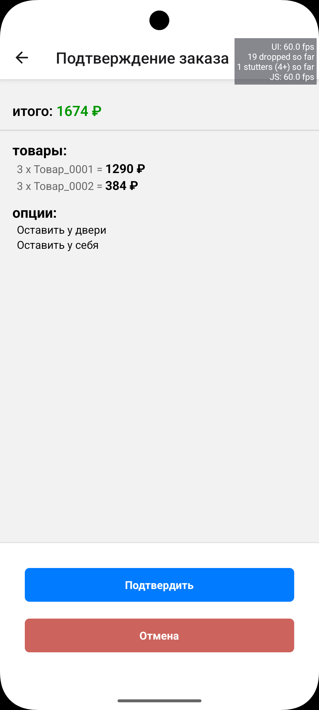
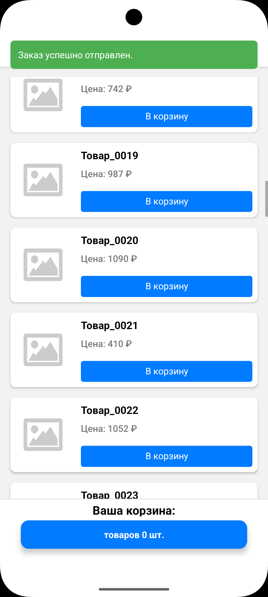
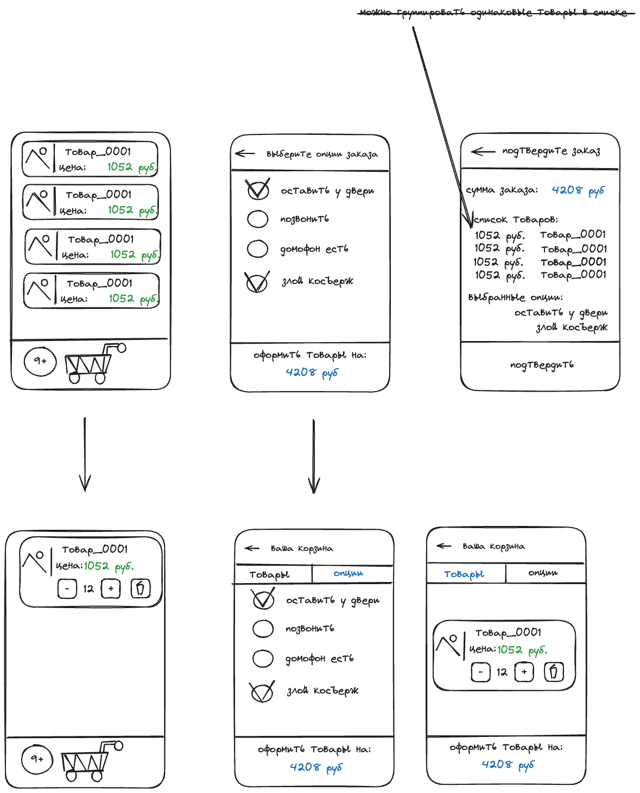

<details>
  <summary>Превью экрана (нажмите, чтобы раскрыть)</summary>

  <p align="center">
    
    
    
    
    
  </p>

</details>

# CartTest — мини-приложение для оформления заказов

## 📦 Описание

CartTest — это React Native приложение, разработанное в рамках тестового задания. Оно демонстрирует покупку товаров с
возможностью выбора дополнительных опций, подтверждением заказа и отправкой аналитики. Проект реализован без
использования Expo, с применением TypeScript и MobX для управления состоянием.

## 🧩 Функциональность

- Просмотр большого списка товаров (1000 позиций)
- Добавление/удаление товаров в корзину, изменение количества
- Выбор опций доставки (например, "оставить у двери", "позвонить")
- Проверка минимальной суммы заказа (1000 ₽)
- Подтверждение заказа с отображением:
    - Списка товаров (имитация api сервиса)
    - Выбранных опций (доступные опции также подгружаются с mock api сервиса)
    - Общей суммы
- Отправка аналитики на каждое изменение корзины/опций (при неудачной отправке, отображается Toast на 3 секунды)
- Имитация случайных ошибок от сервиса:
    - сервис недоступен
    - недостаточно товаров
    - не достигнута минимальная сумма
- UI-индикация загрузки, ошибок и статусов

## 🧠 Архитектура и структура

```
src/
├── App.tsx                 # Root компонент
├── appStoreContext.tsx     # Провайдер MobX стора
├── assets/                 # Локальные ресурсы (заглушки)
├── components/             # Atomic UI (примерно)
├── constants.ts            # Константы проекта
├── navigation/             # React Navigation (Stack)
├── reactions.ts            # MobX-реакции на события
├── screens/                # Экраны: товары, корзина, подтверждение
├── services/               # Имитация API: продукты, опции, аналитика, заказы
└── stores/                 # MobX-сторы: товары, корзина, аналитика, тосты
```

## 📊 Аналитика

Каждое событие изменения корзины фиксируется в `analyticsEventsStore`. Событие содержит:

- Полный payload (товары + опции)
- Статус: `pending`, `success`, `error`
- Текст ошибки, если есть

Хранится до 300 последних событий (`MAX_EVENTS`) — более старые удаляются из массива.

## ⚠️ Обработка ошибок

Помимо перечисленных ошибок в ТЗ, с небольшой вероятностью ошибки
генерируют сервис списка товаров `(API списка товаров не доступен)` и сервис списка опций
`(API списка опций не доступен)`

- Ошибки от "сервера" записываются в хранилище событий и отображаются через `ToastBar` — верхний тост-индикатор:
- Во время ожидания ответа сервера отображается индикаторы загрузки (`FullScreenIndicator`)

## 📐 Используемые технологии

- **React Native** (BareFlow)
- **TypeScript** для типизации моделей и API
- **MobX** для управления состоянием
- **React Navigation** (Stack)
- **Custom UI** без UI-библиотек
- **Jest** (готово под тесты)

# ⚠ Важно: проблема совместимости с react-native-pager-view

В текущей версии react-native (0.79.1) используется библиотека react-native-pager-view версии 6.7.0, в которой
зафиксирована проблема совместимости. Без применения патча проект не соберётся.

Для автоматического устранения этой проблемы в проекте предусмотрен скрипт postinstall, который должен запускаться
автоматически после установки зависимостей (npm install).

Если по каким-либо причинам postinstall не отработал:

Запустите его вручную:

`npm run postinstall`

Или примените исправления вручную, как описано в начале самого скрипта (см. комментарий со ссылкой на issue).

Патч временный и может быть удалён после выхода официального исправления в одной из будущих версий
react-native-pager-view.

## ▶️ Запуск

1. Установите зависимости:

```bash
npm install
```

2. Запустите сборку:

```bash
npx react-native run-ios
# или
npx react-native run-android
```

> Убедитесь, что настроена среда React Native CLI.

## ✏️ Wireframe (макет)

Макет приложения доступен в папке `excallidraw/`:


